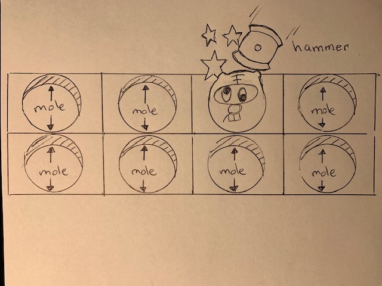

*****Whack A Mole*****
What's going on here?
Its everyone's childhood favorite. Use a wooden mallet to whack a mole back into the ground it popped out of. It's fun, it's infuriating.  The mole is always one step ahead. Is he really that smart or is there a pattern to his diabolical escape?  It seems like he only speads up. Find out if you can defeat the mole with your lightning fast fingers. 

Become the envy of all your friends with a trophy from this classic.

*****Tech Stack*****
html, css, javascript, paint.net, mp3

*****MVP*****
Render game screen displaying the start button, canvas, turn counter, and player high score
Render a wooden mallet that can move using the mouse pointer
Render the moles prarie where he hides 
Render a mole that can move up and down the Y axis and side to side on the X axis`
Record the most hits` on the mole in the before the timer ends 
Render next level where the mole's movement speed is increased

*Rather than making the game two players I opted to have it record the high score of each player.  This made more sense since the game would be played from the same computer where the mouse is shared

*****Stretch Goals*****
Render coin collector to purchase level up items
Render level up items like bigger mallet for more damage
Render shop to purchase level up items

*****Potential Roadblocks*****
creating image that can appear to grow and shrink into the moles hiding place.

*The biggest challenge was rendering a mallet that when striking an object would register a hit since the pointer position was pushed away from the side of the mallet

{Reference project1 lines 100-111: KODAKTIF youtube video was used to render the rotating mallet function}

wireframe:

link to game: https://professorsurf.github.io/Project1/